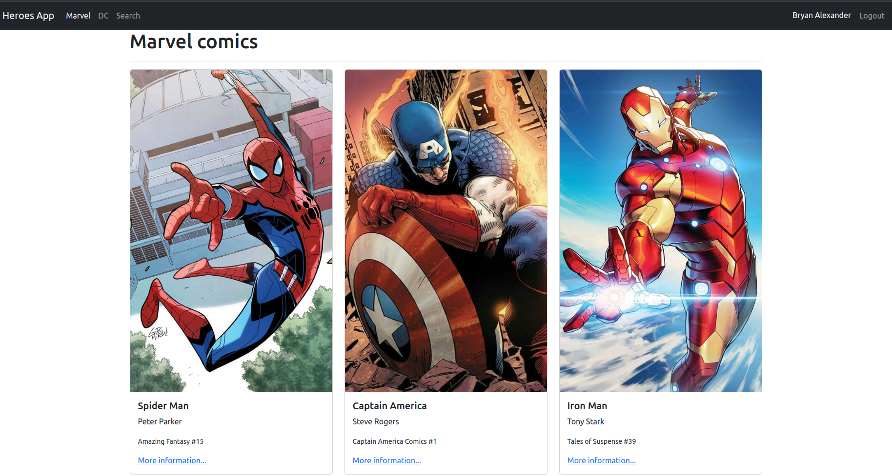
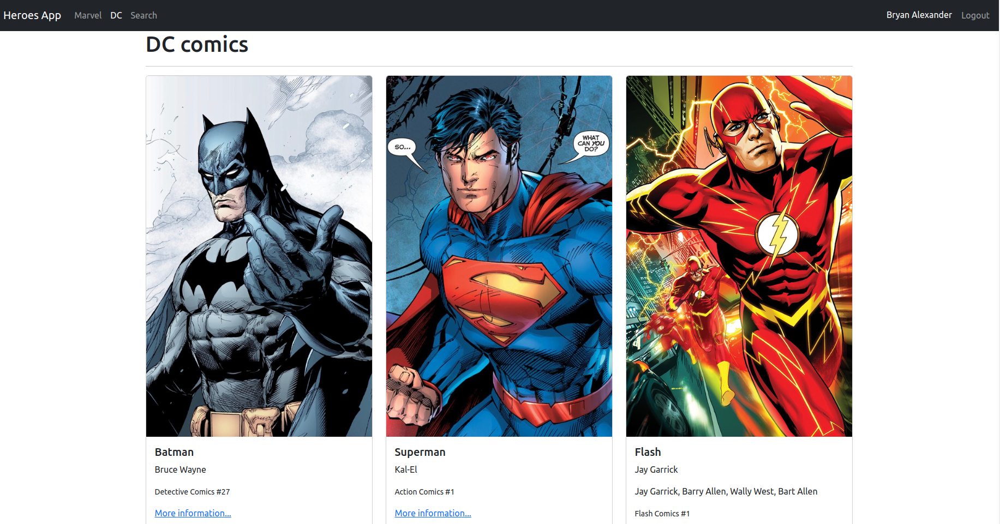
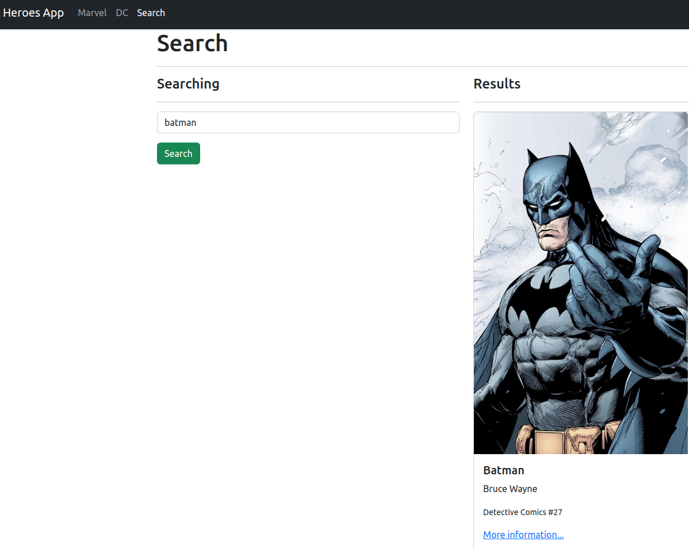

# Heroes React App

This application is the result of the React: [De cero a experto ( Hooks y MERN )](https://www.udemy.com/course/react-cero-experto/) course, it consists of a simple application with basic and advanced React concepts.

## Installation

Get code using

```
git clone https://github.com/baguilar6174/react-heroes-app.git
```

Step 2:

Install the necessary libraries (make sure you have node and yarn)

```
yarn
```

Step 3:

Runs the app in the development mode

```
yarn dev
```

Open [http://localhost:5173](http://localhost:5173) to view it in the browser.

## My process

### Built with

- Semantic HTML5 markup
- Bootstrap
- React JS 18
- React Router DOM
- Vite

## What I learned

- SPA (Single Page Application)
- Multiple Routers
- Push and Replace in History
- Read arguments by URL
- QueryParams
- Apply filters using QueryStrings
- Public routes
- Private routes
- Login and logout - No backend
- Remember which was the last visited route to improve the user experience.
- Context
- Reducer
- Custom Hooks

## Project status

Currently, the project contains a simple application that loads hero data from a JS file. This data is displayed using Boostrap. In addition, the application contains a public and private route handler and the login and logout function using localstorage.

## Heroes React App

<table>
  <tr>
    <td align="center" valign="center"></td>
  </tr>
 </table>

<table>
  <tr>
    <td align="center" valign="center"></td>
  </tr>
</table>

<table>
  <tr>
    <td align="center" valign="center"></td>
  </tr>
</table>

## Author

- Website - [www.bryan-aguilar.com](https://www.bryan-aguilar.com/)
- Medium - [baguilar6174](https://baguilar6174.medium.com/)
- LinkeIn - [baguilar6174](https://www.linkedin.com/in/baguilar6174)
- Email - [bryan.aguilar6174@gmail.com](mailto:bryan.aguilar6174@gmail.com)
